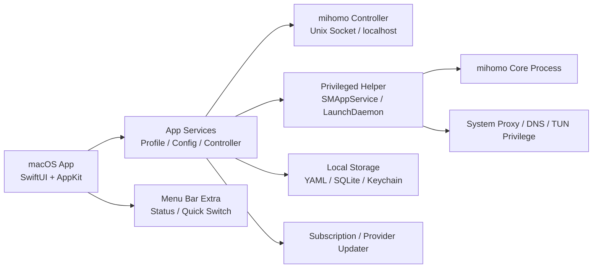

# Mihomo macOS 原生客户端软件开发报告

生成日期：2026-07-05  
目标：设计一款 macOS 原生 UI 的 mihomo 客户端，功能参考 Sparkle 但不照搬，界面风格参考本机 Surge 6.7.0 的专业网络工具体验。

## 1. 参考对象与学习结论

| 对象 | 本次检查依据 | 关键结论 |
| --- | --- | --- |
| `xishang0128/sparkle` | `d561e27739771251e682afef4384524f33718cb2`，Electron + React + TypeScript | 功能面完整，覆盖订阅、代理组、规则、连接、日志、TUN、DNS、嗅探、覆写、Sub-Store、备份、更新、托盘、轻量模式。适合作为功能参考，不适合作为 macOS 原生 UI 的架构模板。 |
| `UruhaLushia/sparkle-service` | `5acde12bde599553ffa3a95179897da60aaaf8a5`，Go service | 清晰承担特权能力：核心进程托管、系统代理、DNS、服务启停、事件推送、安全认证。macOS 版本建议借鉴职责划分，但使用更原生的 Helper/XPC/LaunchDaemon 方案。 |
| 本机 Surge | `/Applications/Surge.app`，版本 6.7.0 | UI 是原生 macOS 专业工具风格：Sidebar、Toolbar、Split View、Table、Inspector、Popover、状态卡片、菜单栏状态项，强调状态、开关、诊断、列表，而非装饰性页面。 |

两套 Sparkle 参考仓库均为 GPL-3.0。若直接复制、修改或链接分发相关代码，需要提前处理 GPL 开源义务。建议本项目仅吸收产品能力和架构思想，重新实现 Swift/SwiftUI 代码与 macOS 原生交互。

## 2. 产品定位

建议定位为“面向 macOS 用户的专业 mihomo 控制台”。核心差异不是堆功能，而是把 mihomo 的复杂配置收敛为可理解、可诊断、可恢复的原生体验。

目标用户：

- 需要长期运行代理/TUN 的 macOS 用户。
- 使用多个订阅、策略组、规则集、DNS/TUN 配置的进阶用户。
- 希望接近 Surge 信息密度，但底层使用 mihomo 的用户。

产品原则：

- 原生优先：SwiftUI + AppKit，使用系统 Sidebar、Toolbar、Table、Settings、Menu Bar Extra、Notifications。
- 状态优先：主界面第一屏展示接管状态、核心状态、当前 Profile、出站模式、实时流量、连接数。
- 可恢复：核心、系统代理、DNS、TUN 任一环节失败时，要能一键诊断和回滚。
- 不照搬 Sparkle：功能可参考，信息架构、交互、代码实现、视觉语言重新设计。

## 3. 推荐技术架构

建议模块：

| 模块 | 职责 | 建议实现 |
| --- | --- | --- |
| macOS 主 App | UI、状态展示、用户操作、偏好设置 | SwiftUI 为主，AppKit 承接 NSTableView、NSStatusItem、窗口细节 |
| Core Manager | 生成运行配置、启动/停止 mihomo、连接 controller | Swift service 层，必要时委托 Helper |
| Privileged Helper | TUN、DNS、系统代理、核心进程托管、权限修复 | SMAppService 注册 helper，XPC 或本地 Unix Socket 通信 |
| Profile Store | 订阅、本地配置、覆写片段、当前配置 | YAML 文件 + SQLite 元数据，敏感信息放 Keychain |
| Controller API | `/proxies`、`/rules`、`/connections`、`/traffic`、`/logs` 等 | 封装为 typed client，UI 不直接拼 API |
| Event Bus | 流量、连接、日志、核心事件、系统代理状态 | Combine / AsyncSequence |
| Updater | mihomo core、Geo 数据、外部资源更新 | 独立任务队列，支持失败重试 |

## 4. Surge 风格的 macOS 原生界面建议

主窗口建议采用三栏/两栏自适应结构：

| 区域 | 设计建议 |
| --- | --- |
| Sidebar | 固定主分区：概览、活动、策略、规则、Profile、资源、DNS、日志、设置。避免 Sparkle 那种卡片式导航，改为原生列表与分组。 |
| Toolbar | 放置核心开关、系统代理/TUN 状态、出站模式、当前 Profile、快速诊断按钮。 |
| Content | 使用 Table、Outline、Form、Split View。代理组、规则、连接都应是高密度可排序列表。 |
| Inspector | 选中连接、规则、代理节点时显示详情、延迟、链路、进程、最近日志。 |
| Menu Bar | 显示上下行速率、当前策略/模式；提供启停、切换 Profile、切换出站模式、打开窗口、退出。 |
| Settings | 使用 macOS Settings Scene：通用、内核、网络接管、订阅、更新、备份、高级。 |

视觉基调：

- 使用系统材质、系统颜色、SF Symbols、标准控件。
- 表格和列表优先，卡片只用于概览状态块或重复资源项。
- 重要状态用短文本 + 色点/图标，例如 Running、System Proxy On、TUN On、Controller Connected。
- 避免大面积渐变、营销式首页和 Web UI 组件感。

## 5. 功能候选表

优先级说明：P0 为 MVP 必需，P1 为首版强烈建议，P2 为进阶功能，P3 为可后置或插件化。

| 选择 | 功能 | 参考来源 | 建议设计 | 优先级 | 复杂度 | 备注 |
| --- | --- | --- | --- | --- | --- | --- |
| 待选 | mihomo 内置核心 | Sparkle 内置 stable/alpha core | App Bundle 携带 stable core，alpha 作为高级更新通道 | P0 | 中 | 分发时注意 mihomo 许可证与签名。 |
| 待选 | 使用系统 mihomo | Sparkle `system` core | 设置页选择外部二进制，启动前校验版本和权限 | P1 | 中 | 适合高级用户。 |
| 待选 | 核心启动/停止/重启 | Sparkle Core Manager / service | Toolbar 与菜单栏提供主开关，失败时进入诊断页 | P0 | 中 | 要保存启动日志和最近错误。 |
| 待选 | Helper 托管核心 | sparkle-service | 用原生 Helper/LaunchDaemon 管理特权启动和崩溃恢复 | P1 | 高 | macOS 上比普通提权更稳定。 |
| 待选 | 系统代理开关 | Sparkle sysproxy / Surge 概览 | 概览与菜单栏均可启停，显示当前网络服务状态 | P0 | 中 | 需支持恢复用户原设置。 |
| 待选 | TUN 模式 | Sparkle TUN | 设置页配置，概览页只显示开关和健康状态 | P0 | 高 | 权限、路由、DNS 回滚是重点。 |
| 待选 | 出站模式切换 | Sparkle outbound switcher / Surge 活动页 | Rule / Global / Direct 三段式控件 | P0 | 低 | 与 mihomo `mode` 对齐。 |
| 待选 | Profile 管理 | Sparkle Profiles | 原生列表 + 编辑器，支持本地/远程/拖入导入 | P0 | 中 | 首版不必完全复制高级字段。 |
| 待选 | 订阅自动更新 | Sparkle profile updater | 每 Profile 设置更新周期、失败通知、手动刷新 | P1 | 中 | 任务队列化，避免 UI 卡顿。 |
| 待选 | 订阅流量信息 | Sparkle 解析 `subscription-userinfo` | Profile 列表显示用量、到期、更新时间 | P1 | 低 | 需要兼容不同机场头格式。 |
| 待选 | 证书指纹校验 | Sparkle remote profile | 远程 Profile 可选 pinning | P2 | 中 | 安全高级项，默认隐藏。 |
| 待选 | Age 加密 Profile | Sparkle profile encryption | 敏感配置加密存储，密钥放 Keychain | P2 | 中 | 可简化为“加密本地配置”。 |
| 待选 | 运行配置生成 | Sparkle factory merge | 订阅 + 控制配置 + 片段合成 runtime config | P0 | 高 | 这是稳定性的核心。 |
| 待选 | YAML 覆写片段 | Sparkle override YAML | 以“配置片段”形式管理，支持预览 diff | P1 | 中 | 比脚本覆写更安全。 |
| 待选 | JS 脚本覆写 | Sparkle override JS | 作为高级实验功能，默认关闭，沙盒运行 | P3 | 高 | 风险高，建议后置。 |
| 待选 | 配置预览/Diff | Sparkle raw/current/override/runtime views | 显示原始、合并后、最终运行配置，可导出 | P1 | 中 | 对排错很有价值。 |
| 待选 | 策略组管理 | Sparkle Proxies / Surge Proxy | 分组列表 + 节点表格 + 搜索 + 延迟排序 | P0 | 中 | 首版核心体验。 |
| 待选 | 节点延迟测试 | Sparkle group/proxy delay | 单节点、单组、全部并发测试，可配置 URL 和并发 | P0 | 中 | 需限制并发，避免压垮 controller。 |
| 待选 | 自动关闭连接 | Sparkle 切换策略后 close connections | 切换节点时可选择关闭相关连接 | P1 | 低 | 放在设置中。 |
| 待选 | 连接列表 | Sparkle Connections / Surge Activity | NSTableView 风格：进程、域名、链路、速率、规则、时间 | P0 | 高 | 信息密度要接近 Surge。 |
| 待选 | 连接详情 Inspector | Surge Activity | 选中连接显示请求链路、进程、规则、流量详情 | P1 | 中 | 比弹窗更原生。 |
| 待选 | 连接过滤/分组 | Sparkle advanced filter | 按进程、域名、策略、规则、连接状态过滤 | P1 | 中 | 适合专业用户。 |
| 待选 | 实时流量图 | Sparkle traffic monitor / Surge Activity | 概览页小图 + 活动页详细图 | P0 | 中 | 菜单栏显示上下行速率。 |
| 待选 | 日志流 | Sparkle Logs | 按 level、来源、关键词过滤，支持暂停和复制 | P0 | 中 | 使用 ring buffer 控内存。 |
| 待选 | 核心运行日志落盘 | sparkle-service log writer | 可配置保留天数和单文件大小 | P1 | 中 | 诊断必备。 |
| 待选 | 规则查看 | Sparkle Rules / Surge Rule table | 表格显示类型、值、策略、命中次数、注释 | P1 | 中 | Surge 风格很适合这里。 |
| 待选 | 禁用规则 | Sparkle `rules/disable` | 可选高级项，支持临时禁用和恢复 | P2 | 中 | 需确认 mihomo 版本兼容。 |
| 待选 | Rule Provider 管理 | Sparkle Resources | 外部资源页显示状态、类型、路径、最后更新 | P1 | 中 | 与 Surge 外部资源页类似。 |
| 待选 | Proxy Provider 管理 | Sparkle Resources | Provider 列表、手动更新、状态提示 | P1 | 中 | 首版可只做查看和刷新。 |
| 待选 | DNS 设置 | Sparkle DNS / Surge DNS | Form + 表格：nameserver、policy、fake-ip、hosts | P1 | 高 | 配置项多，要分基础/高级。 |
| 待选 | 自动设置系统 DNS | Sparkle TUN DNS | TUN 开启时可由 Helper 设置公共 DNS，关闭时恢复 | P2 | 高 | 回滚机制必须可靠。 |
| 待选 | Sniffer 设置 | Sparkle Sniffer | 基础开关 + 协议端口表 + 跳过域名/IP | P1 | 中 | 默认使用 mihomo 推荐值。 |
| 待选 | 外部控制器/UI | Sparkle external-controller/UI | 允许启用 zashboard/metacubexd，但不作为主体验 | P2 | 中 | 原生 App 是主控制面。 |
| 待选 | Geo 数据更新 | Sparkle upgrade geo | 一键更新 GeoIP/GeoSite/MMDB/ASN | P1 | 中 | 显示数据版本与更新时间。 |
| 待选 | mihomo Core 更新 | Sparkle core upgrade | stable/alpha 通道，下载校验，失败回滚 | P1 | 高 | 签名、校验、回滚要做。 |
| 待选 | WebDAV 备份恢复 | Sparkle backup | 备份 Profile、设置、片段；恢复前生成本地快照 | P2 | 中 | 可以先做本地导入导出。 |
| 待选 | Gist 同步 | Sparkle Gist | 高级同步选项 | P3 | 中 | 不是 macOS 首版刚需。 |
| 待选 | Sub-Store 集成 | Sparkle Sub-Store | 可作为“订阅工具箱”或插件入口 | P2 | 高 | 功能强但会拉高维护成本。 |
| 待选 | 深链导入 | Sparkle deep link | `mihomo://install-profile`、`mihomo://install-override` | P1 | 中 | 导入前必须确认来源。 |
| 待选 | 菜单栏快速操作 | Sparkle tray / Surge menu bar | 状态、速率、Profile、模式、策略快捷切换 | P0 | 中 | macOS 体验关键。 |
| 待选 | 浮动窗口 | Sparkle floating window | 小流量窗或 mini panel | P3 | 中 | 容易打扰，建议后置。 |
| 待选 | 快捷键 | Sparkle shortcut | 打开窗口、切换代理、启停系统代理 | P2 | 低 | 放在高级设置。 |
| 待选 | 开机启动/静默启动 | Sparkle startup | 登录项、启动后最小化到菜单栏 | P1 | 中 | 使用 macOS Login Item API。 |
| 待选 | 轻量模式 | Sparkle auto lightweight | 关闭主窗口但保留核心/菜单栏 | P1 | 中 | 很适合 macOS 常驻工具。 |
| 待选 | 主题系统 | Sparkle themes | 首版只跟随系统浅/深色 | P3 | 中 | 原生 UI 不建议早期做复杂主题。 |
| 待选 | 自定义托盘图标 | Sparkle custom tray icon | 后置 | P3 | 低 | 对核心价值影响小。 |
| 待选 | 远程 HTTP API | Surge 设置参考 | 可选开启本地 API，默认关闭 | P3 | 中 | 安全风险高。 |
| 待选 | 网络诊断 | Surge Activity/Diagnostics | 检测 controller、系统代理、TUN、DNS、外网延迟、权限 | P0 | 高 | 建议做成首版亮点。 |

## 5.1 v0.5.0 实现状态

当前仓库已经从“开发报告”推进到可运行的第五版 MVP。新增功能没有复制 Sparkle 的 Electron/Go 代码，而是在 SwiftUI/AppKit 和 Swift service 层重新实现。

| 功能 | v0.5.0 状态 | 主要落点 |
| --- | --- | --- |
| 内置 mihomo core | 已实现 release bundle 路径 | `script/prepare_core_bundle.sh` 下载 `vendor/mihomo`，`script/build_and_run.sh` 打入 `Contents/Resources/Core/mihomo`，App 启动时可作为有效 core。 |
| mihomo Core 更新 | 已实现托管更新 | 高级页下载 core 到 `~/Library/Application Support/Mihomo/Core/mihomo`，并可启用托管 core。 |
| Helper/LaunchDaemon 托管核心 | 已实现 LaunchDaemon 路径 | 通过管理员授权安装/卸载 `/Library/LaunchDaemons/dev.codex.Mihomo.core.plist`，使用当前 runtime config 托管核心。 |
| 自动设置系统 DNS | 已实现 | 启动 core 前使用 `networksetup` 设置 DNS，停止/退出时通过快照恢复。 |
| 外部控制器/UI | 已实现 UI 管理 | 支持下载 zashboard/metacubexd 类 zip，写入 `external-ui`、`external-ui-name`、`external-ui-url`。 |
| 远程 HTTP API | 已实现默认关闭与显式启用 | 默认绑定 `127.0.0.1`，开启后使用指定 bind address；Controller 客户端支持 Bearer secret。 |
| 证书指纹校验 | 已实现 | 远程 Profile 首次导入记录 HTTPS 证书 SHA-256，刷新时校验 pin。 |
| YAML 覆写片段 | 已实现 | 高级页管理片段，runtime config 生成时追加启用的 YAML 片段。 |
| JS 脚本覆写 | 已实现高级开关 | 使用 JavaScriptCore 执行启用片段中的 `transform(config)`，默认关闭。 |
| 配置预览/Diff | 已实现 | 高级页显示合并后的 runtime config 与原始配置的行级 diff。 |
| 规则查看 | 已实现 | 规则页解析当前 Profile 的 `rules`。 |
| 禁用规则 | 已实现 | 禁用列表持久化，runtime config 生成时过滤对应规则。 |
| Rule Provider 管理 | 已实现 | 资源页本地解析 `rule-providers`，Controller 可用时读取/更新。 |
| Proxy Provider 管理 | 已实现 | 资源页本地解析 `proxy-providers`，Controller 可用时读取/更新。 |
| DNS 设置页 | 已实现 | 高级页管理系统 DNS、mihomo DNS enhanced-mode、nameserver、fallback。 |
| Sniffer 设置 | 已实现 | 高级页管理开关、端口、force-domain、skip-domain，并写入 runtime config。 |
| Geo 数据更新 | 已实现 | 高级页下载 GeoIP/GeoSite 到 App Support 的 Geo 目录。 |
| WebDAV 备份恢复 | 已实现 | 支持本地 zip 备份、WebDAV PUT 上传、WebDAV 下载并恢复。 |
| Gist 同步 | 已实现 | 使用 `mihomo-backup.json` 同步设置、Profile、片段和禁用规则。 |
| 深链导入 | 已实现 | 注册 `mihomo://`，支持导入 Profile 和覆写片段。 |

## 6. 建议 MVP 范围

第一版建议控制在“稳定运行 + 高质量原生体验”：

| MVP 功能 | 说明 |
| --- | --- |
| 核心管理 | 内置 mihomo stable、启动/停止/重启、运行状态、最近错误。 |
| Profile | 本地/远程订阅导入、切换、手动更新、基础用量显示。 |
| 网络接管 | 系统代理、TUN、出站模式、权限检查、失败回滚。 |
| 策略组 | 策略组列表、节点选择、延迟测试、搜索排序。 |
| 活动 | 实时流量、连接列表、连接关闭、基础过滤。 |
| 日志 | 实时日志、级别过滤、复制、保存最近日志。 |
| 诊断 | 一键检查核心、controller、系统代理、TUN、DNS、订阅可达性。 |
| 菜单栏 | 速率、开关、当前 Profile、出站模式、打开主窗口。 |

早期建议将 Sub-Store 深度集成、复杂主题、自定义图标和完整 XPC Helper 后置。v0.5.0 已把 JS 覆写、WebDAV/Gist 同步和远程 HTTP API 做成高级页能力，并保持默认关闭或显式启用。

## 7. 数据与配置设计

建议目录：

| 类型 | 建议位置 |
| --- | --- |
| 用户配置 | `~/Library/Application Support/<AppName>/config.yaml` |
| Profiles | `~/Library/Application Support/<AppName>/Profiles/*.yaml` |
| Runtime config | `~/Library/Application Support/<AppName>/Runtime/config.yaml` |
| Logs | `~/Library/Logs/<AppName>/` |
| Helper 配置 | `/Library/Application Support/<AppName>/` 或 Helper 自有目录 |
| 密钥/Token | Keychain |

运行配置生成流程：

1. 读取当前 Profile 原始 YAML。
2. 应用安全的配置片段和 UI 控制项。
3. 清理空字段、平台不兼容字段和危险字段。
4. 输出 runtime config。
5. 启动 mihomo，并通过 controller 验证可用性。
6. 若失败，恢复上一个可用 runtime config。

## 8. 关键风险

| 风险 | 影响 | 应对 |
| --- | --- | --- |
| macOS 权限与 TUN 稳定性 | 无法接管网络或关闭后残留路由/DNS | Helper 执行特权操作，所有操作记录原状态并支持回滚。 |
| GPL-3.0 合规 | 分发风险 | 不复制 Sparkle/service 代码；若内置 mihomo 或 GPL 组件，准备源代码和许可证说明。 |
| mihomo controller 版本差异 | API 不兼容 | 启动时读取 `/version`，按版本启用功能开关。 |
| 订阅质量不可控 | 配置生成失败 | 导入时校验 YAML，运行前 dry-run 或启动失败回滚。 |
| JS 覆写安全 | 任意代码风险 | 不进 MVP；若实现，必须沙盒、权限限制、明确警告。 |
| 菜单栏常驻资源占用 | 长期运行耗电 | WebSocket 自动重连节流，连接/日志列表虚拟化，后台采样降频。 |
| 系统代理/DNS 残留 | 用户网络异常 | 保存原配置，退出/崩溃恢复，提供“修复网络设置”按钮。 |

## 9. 开发里程碑

| 阶段 | 目标 | 产出 |
| --- | --- | --- |
| M0 原型 | 验证 mihomo core 启动、controller 连接、菜单栏速率 | SwiftUI App、core wrapper、基础 controller client |
| M1 核心 MVP | Profile、系统代理、TUN、策略组、日志、连接 | 可日常使用的本地版本 |
| M2 原生体验 | Surge 风格活动页、诊断页、Settings、Inspector | 完整主窗口和菜单栏体验 |
| M3 稳定性 | Helper、权限修复、失败回滚、更新、崩溃恢复 | 可分发 Beta |
| M4 高级功能 | DNS 细项、资源管理、配置 diff、备份、Sub-Store 可选集成 | 面向进阶用户的功能扩展 |

## 10. 下一步决策

后续建议围绕稳定性和分发硬化继续收敛，而不是继续横向扩功能。最推荐的下一轮组合是：

- 完整 XPC Helper 与签名/公证流程。
- Keychain 存储 Gist/WebDAV/Controller secret。
- 更严格的 YAML AST 合并与 provider/rule 命中统计。
- Sub-Store 作为独立高级集成，而不是主体验依赖。

这样可以把当前“像 Surge 一样专业，但底层是 mihomo”的 macOS 原生产品骨架，继续推进到可长期分发和日常托管的 Beta 质量。
